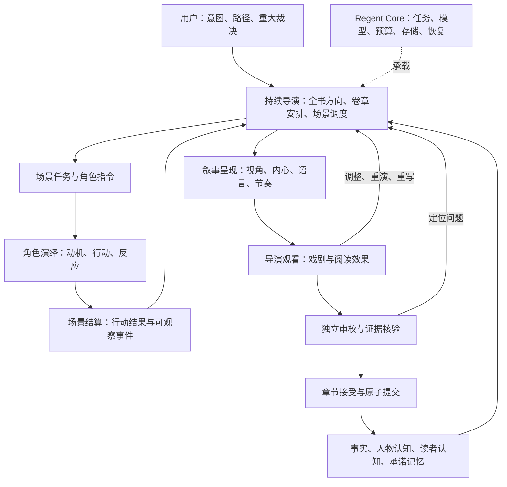

# Novel Engine 技术规范

> 版本：v5.3
>
> 更新：2026-09-07
>
> 状态：ACTIVE — 当前技术实现唯一权威源

## 1. 架构原则：导演负责创作

本版为目标架构。场景导演闭环已完成首轮代码接入，完整长篇能力仍待验证与实施。它取代固定六步章节流水线和“硬导演/软导演”审核架构。现有作品、接口和 Core 能力按 §14 迁移，不把文档更新视作上线。

### 1.1 产品与创作控制权

用户是作品方向的最终决策者：定义意图、调整关键路径、裁决重大变化。AI 导演是日常创作负责人：构思戏剧、调度人物、选择叙事方式、观看产物、决定继续或重演，对最终阅读体验负责。

导演不是固定链条中的一次调用。导演拥有持久的创作意图和决策记录，通过受约束的命令驱动创作循环；底层运行时掌管权限、状态迁移、预算与提交。创作判断使用模型，执行合法性由代码判定。

质量首先在创作中形成：人物选择的可信度、冲突的组织、情绪变化、信息揭示和承诺兑现。审校提供独立证据，不能代替导演创作，也不能以通过检查宣称文学质量。

### 1.2 全局结构



保留模块化单体、API + Worker + PostgreSQL + 不可变产物存储，不为每个创作职责新建微服务。职责不等于常驻 Agent；同一模型可承载多个职责，但输入权限、产物和决策必须分开。

### 1.3 所有权与边界

| 组件 | 负责 | 不得越权 |
|---|---|---|
| Director | 创作意图、人物弧线、章节/场景设计、叙事指令、选取 take、重演与组章 | 不直接写事实、不覆盖硬失败、不替用户修改锁定方向 |
| Character Performer | 根据欲望、关系、认知和当下刺激提出行动、台词、反应 | 不知道导演秘密目标、未来结局或其他人物隐私；不自行宣布行动成功 |
| Scene Resolver | 依据世界规则和当前状态结算行动，形成可观察事件 | 不为满足预设高潮篡改规则；不把未执行行动当事实 |
| Narrative Writer | 将选定场景转成小说，执行视角、叙述距离、内心与语言指令 | 不擅自新增重大事件、知识获取、人物或能力 |
| Continuity Supervisor | 验证时间、空间、资源、知识、事件及正文对应关系 | 不决定戏剧走向，不用计划字段代替正文证据 |
| Editorial Reviewer | 提供表达、冗余、声纹和可读性意见 | 不擅自改变剧情；不以一个分数接管导演 |
| Context/Memory Service | 按角色、叙述视角、时点和依赖编译上下文，持久化证据 | 不默认把缺失权限的秘密视作公开 |
| Production Runtime | 命令校验、任务调度、预算、幂等、租约、提交、重放 | 不通过字数或重试次数降低质量门槛 |

导演可见作品级事实与未来计划；事实、计划、假设必须分区标注。人物仅见角色投影，执笔者仅见当前叙事允许的信息。跨轮上下文重新编译，禁止复用带秘密的共享会话。

### 1.4 并发契约

持续导演 loop 是主流程。Hive 仍仅在信息隔离且任务无前置依赖时启用，例如同一时刻多个角色独立作出第一反应。依赖对手上一动作的反应按节拍顺序执行；导演等待表演和结算结果后才能决策。条件由调度器判断，不由模型选择。

## 2. 工程分层与模块

```text
core/src/regent/novel/
  domain/          # 意图、场景、take、事件、认知、承诺、命令与状态规则
  application/
    direction/    # 持续导演、层级规划、决策与重演范围
    performance/  # 角色指令、节拍表演、场景结算
    narrative/    # 小说化、组章、呈现修订
    continuity/   # 正文事件核验、知识与世界规则
    memory/       # 检索、投影、上下文 manifest
    production/   # 任务推进、提交、恢复、预算适配
  ports/          # ModelGateway、Runtime、Repository、ArtifactStore
  infrastructure/ # PostgreSQL、Core 适配器、不可变产物
  api/            # 用户态投影与现有作品接口
apps/novel-web/    # 三动作、进度、阅读与试读
```

这是目标模块布局。逐项迁出 generation.py 与 works.py，禁止先复制成两套领域实现。Core 仅提供基础设施，不持有小说语义。内部运行记录与角色秘密不得进入用户进度事件；运维界面单独授权。

## 3. 创作对象、状态与记忆

### 3.1 层级创作对象

| 对象 | 核心内容 |
|---|---|
| StoryIntent | 原始构思、目标读者、题材承诺、风格、用户锁定项 |
| DirectionBible | 核心戏剧问题、人物弧线、世界约束、叙述原则、禁用捷径 |
| ArcPlan / CriticalPath | 卷/故事弧目标、承诺、因果节点、依赖、可调整范围 |
| ChapterIntent | 本章阅读体验、期待与兑现、情绪起落、候选场景、结束理由 |
| SceneBrief | 场景存在理由、参与者、时空、冲突、情绪目标、信息揭示、退出条件 |
| ActorBrief | 本人目标、障碍、可观察刺激、个人表演指令和知识投影 |
| PerformanceTurn | 行动意图、台词、可见动作、私有动机、输入来源 |
| SceneTake | 一次场景尝试、节拍序列、结算事件、工作状态差异、父版本 |
| NarrativeSpec | POV、叙述距离、读者可知内容、内心权限、详略、语体、转场 |
| SceneProse / ChapterEdition | 正文、所用 take、组章顺序、版本与内容 hash |
| DirectorDecision | 观察、目标偏差、证据、所选命令、预期改善、重演范围 |
| ValidationReport | 检查项、严重度、证据片段、事实来源、pass/fail/abstain |

一位导演在全书、卷、章、场景四种尺度工作；不强制建立四个互相讨论的导演 Agent。全书方向稳定，滚动细化近期场景，远期节点保持可调整。取消固定“每节点三章”和每章必须升级的硬编码；章数由因果完成度和阅读节奏决定。

### 3.2 记忆的六个视图

1. **世界事实**：稳定规则与已经提交的客观事件，带来源和版本。
2. **人物状态**：位置、资源、伤势、关系、欲望、承诺和弧线阶段。
3. **人物认知**：事实、误信、怀疑分别记录；获得时间与来源明确。误信可以驱动行为，但不能写成客观事实。
4. **读者认知**：正文已经揭示、暗示、误导和刻意保留的内容。人物知道不等于读者知道，反之亦然。
5. **承诺与伏笔**：种下、强化、部分兑现、兑现、调整；带证据、预计窗口、关联事件。未知结局是计划，不进入事实。
6. **导演记忆**：创作选择、失败原因、有效表现、尚待解决的问题、风格约束。

Canon 使用 append-only 事件版本链；当前状态是可重建投影。旧事实被新事件改变时保留历史与生效时间。摘要是检索辅助，不能覆盖原始事实或充当唯一来源；稳定规则和未兑现承诺不因超出最近 N 章被遗忘。

ContextManifest 绑定 work/branch/chapter/scene/take/beat、父 Canon、计划、人物、叙事权限及来源 hash。同样的选定来源和版本产生同样投影。检索可以使用模型，但检索结果需先冻结为清单，再确定性裁剪。秘密信息不通过上一章完整结尾、导演指令或共享 scratchpad 旁路泄露。

### 3.3 草稿世界与提交世界

- 场景结算写入分支内 `WorkingState`，用于同章后续场景；它尚非 Canon。
- 每次重演 fork 新 take，只选中的 take 可以参与正文和工作状态。
- 正文新增重大事件时退回导演/结算；微小描写也需确认未改变世界或认知。
- 章节提交前对实际正文重新抽取并核验事件，确认正文与选中 take 一致。
- 只有已接受 ChapterEdition 是阅读、后续章上下文和导出的权威版本；草稿预览必须单独标注与授权。
- 修改已提交历史创建分支及替代版本，失效所有依赖旧事件、认知、承诺的后续产物，不原地覆写。

### 3.4 状态与命令

作品既有状态兼容；ChapterRun 新增 `architecture_version`，目标阶段为 `PLANNING → SCENE_PRODUCTION → ASSEMBLING → VALIDATING → COMMITTING → CANONIZED`，并允许人工等待、预算暂停、重演和终止失败。

SceneRun：`BRIEFED → PERFORMING → RESOLVING → DIRECTOR_VIEW → RENDERING → DIRECTOR_VIEW → VALIDATING → ACCEPTED`。两个 DIRECTOR_VIEW 通过 artifact_kind 区分表演和正文；RETAKE/REWRITE 产生新版本，不覆盖旧状态。

| 导演命令 | 合法前置与效果 |
|---|---|
| PLAN_SCENE | 有 ChapterIntent 和父状态，建立场景与角色任务 |
| REQUEST_PERFORMANCE | 已通过上下文权限检查，启动下一节拍 |
| CONTINUE_SCENE | 有结算结果和剩余预算，编译下一轮可见信息 |
| RETAKE_SCENE | 给出失败证据、变更指令、依赖范围，fork take |
| RENDER_SCENE | 选定合法 take 和 NarrativeSpec，调用执笔者 |
| REWRITE_PROSE | 事件保持一致，改变呈现；修改剧情则回到场景 |
| ACCEPT_SCENE | 导演给出效果证据且无硬失败，接受该场景版本 |
| ASSEMBLE_CHAPTER | 场景接受且依赖合法，进行衔接与节奏编排 |
| REQUEST_USER_DECISION | 超出用户锁定范围或重大不可逆选择，挂起 |
| FINISH_CHAPTER | 效果与审校完成、事实证据齐全，申请原子提交 |

Runtime 校验命令白名单、输入版本、角色权限、预算、最大步数及依赖；模型不能直接更新状态。ACCEPT_SCENE 是章内草稿接受，不等于发布或提交 Canon。

## 4. 导演创作与提交协议

### 4.1 一章的运行

1. 锁定用户方向、父 Canon 与架构版本。导演读取未兑现承诺、人物状态与前章效果，形成 ChapterIntent。
2. 导演设计一个必要场景，说明戏剧目的、人物欲望冲突、读者体验、呈现策略及结束条件。
3. 编译 ActorBrief；人物提出行动，Resolver 依据规则与前状态结算成事件。开放语义可由模型辅助，但强规则由代码约束，模糊结果需显式标记并解决。
4. 导演观察行为与效果：成立则继续或结束；不成立则修改场景条件、表演指令或叙事安排。人物合理的意外选择允许改变未锁定计划；不能为了预设结局强迫人物无动机行动。
5. Writer 按 NarrativeSpec 将选定 take 写成小说，包含内心、自由间接引语、叙述节奏等文学手段，不使用影视分镜替代小说表达。
6. 导演观看正文是否产生预期效果；呈现问题重写正文，表演问题重演，场景设计问题重新调度。
7. 独立审校核对正文、规则和知识；导演处理问题。已通过的规则只在受影响输入变化时重跑，最终章提交进行完整复核。
8. 导演决定是否需要下一场景。按时间、因果与视角依赖组章，不能任意重排破坏信息获得顺序。
9. 核验最终正文的事件、人物认知和读者认知，准备提交包。
10. 短事务校验父版本与 lease fencing token，原子写入 ChapterEdition 指针、CanonCommit、认知/承诺投影及 outbox；并发冲突则重新规划或失效，不能强行提交。

### 4.2 导演如何把控质量

导演在创作前提出可观察意图，在创作后提供对应文本/行动证据。例如“读者知道同伴在隐瞒，主角仍然信任他”，应体现为泄露给读者的动作与主角交付信任的行动，不能只填“紧张感 8 分”。

导演观察五项：人物为什么这么做；选择怎样改变局势；读者现在知道和期待什么；情绪如何发生变化；本场值得占用这些篇幅的理由。舒缓、关系建立、哀悼等场景可以通过，不强制每场冲突升级或每章两个状态字段变化。

硬失败由 Continuity Supervisor 阻断，导演无权降级。审美判断采用题材与场景意图匹配的 rubric；声纹相似度、套句密度和字面重复属于辅助信号，不能机械替代上下文判断。机器无证据应 abstain，关键事实未解决不得提交。

### 4.3 有界探索与最小重演

每章冻结 `max_scene_count / max_turns_per_scene / max_retakes / max_prose_revisions / max_logical_calls / cost_cap / deadline`。首个 pilot 可用 2–4 场、每场最多 4 轮、最多 2 次重演、1 次呈现修订作为实验配置，正式值由盲评和成本校准后版本化。

每次修订必须改变明确的输入或指令并引用失败证据；相同问题连续无改善时停止该策略。不同候选按命令中的 candidate_id 区分，不被幂等缓存误合并。达到上限时保存草稿，进入可恢复失败或预算暂停，不以字数、成本或尝试次数放行。用户只处理方向选择与是否继续，不承担日常场景审校。

重演沿事件、时间、认知、伏笔、人物状态、呈现依赖传播。纯措辞修订保留表演；行动变化失效相关正文及后续场景。MVP 依赖图不完整时保守失效当前章后续全部场景，禁止宣称已经实现最小子图重演。

### 4.4 调用与费用

模型调用在事务外；调用前预留预算，结果持久化后按 logical_call 独立结算。废弃 take 也消耗真实费用，不因章节未接受而退款式抹除流水。章节提交验证相关调用结果与费用状态已记录；outbox/对账修复提交与通知之间的崩溃。

提供方结果不确定时记录 UNKNOWN 并优先查询/对账，不能承诺跨外部服务绝对 exactly-once；没有提供方幂等能力时，盲重试可能产生重复费用，须计入恢复设计。

**UNKNOWN 的终止必须按对账次数，不按模型 attempt**：attempt 只在新一次模型调用时递增，拿它当上限会让 UNKNOWN 永远挂起。每次对账递增 `ModelCall.reconcile_count`（迁移 `20260908_0052`），达到 `reconcile_attempts`（默认 3）后按“费用已发生”结算预留额并置 FAILED，允许后续 attempt 以新的 attempt 号重跑；重复费用留在账上，不抹除。供应商可查时据实结算并写回 `output_json`，之后同键恢复直接复用、不再调用。

**超时类异常若携带供应商 `request_id` 必须落库**，否则对账没有可查对象，只能按估价结清。

**恢复清扫（`production.recover_novel_calls()`）**是 worker 的启动动作与周期任务（默认 30 秒）：先把租约过期仍停在 `RESERVED` 的调用判定为 `UNKNOWN`（保留预留额，不猜成功也不猜失败），再对静默期（默认 60 秒）之前的 `UNKNOWN` 逐条对账。静默期用于避免把供应商尚未落账的调用提前按“钱已花掉”结清。

**预算判据是已结算金额，不是累计预留**：`direction._call` 用 `committed_minor` + 本次估价与章级上限比较，超额在调用发出前停止；预留会被释放，把历史累计预留当成已花掉的钱会高估消耗并放过越界。`CallBroker.budget_limit_minor` 在 `ledger.reserve()` 内按章做原子上限检查，并发预留不得共同突破同一上限。实际费用超过预留时补记 `_top_up`，不得因超限丢账。

## 5. 幂等与恢复

| 操作 | 逻辑幂等键 |
|---|---|
| 新建作品 | `user_id:client_nonce` |
| 章节步骤 | `work:branch:chapter:scene:take:beat:command:input_version` |
| 模型调用 | `production_id:command_id:candidate_id:purpose`（同时校验模型、prompt 与 context hash） |
| 裁决提交 | `decision_id:decision_version:client_nonce` |
| Canon 提交 | `work_id:branch_id:chapter_no:source_output_hash` |
| 配额结算 | `logical_call_id:attempt:funding_pool`（消费/释放/补记均按 attempt 独立记账） |
| 分享/撤回/导出/发布/结算 | 强制 `Idempotency-Key` |

- logical call 与 attempt 分离；已成功 logical call 恢复时复用，不重复内部结算；外部不确定结果按 §4.4 处理。
- **同键判定必须包含调用配置**：`config_fingerprint(model, sampling)` 写入 `ModelCall.sampling.config_hash`，同键换模型或采样参数是 `CallConflict`，不是复用。
- **运行租约复核（P0-4）**：写回结果前复核 owner、fencing token 与有效期，三者缺一即丢弃产出；模型调用在事务外进行，会话默认 `expire_on_commit=False`，因此必须**回查数据库列值**，不能读内存中的 run 对象。
- **输入版本（P0-4）**：用户提交指导或关键路径变更时递增 `input_version`；调用窗口内版本变化即判定本次产出属于旧方向，作废并留痕，不得覆盖新方向。
- 同键同参数返回首个结果；同键异参数返回 409。
- checkpoint 至少为 `work + branch + chapter + scene + take + beat + command + input_version`。
- 恢复响应包含 reused_calls、avoided_cost、last_sequence，允许用户验证未重跑。

## 6. 成本、额度与账本

- 金额统一 `amount_minor BIGINT + currency CHAR(3)`；禁止 Float。
- `ModelCall` 是成本事实源：估算、预留、实际、缓存 token、供应商请求 id、usage 来源、价格版本。
- 额度采用 `reserved → consumed/released` 两段式；失败或取消释放未消费额。
- `QuotaLedger`、`WorkLedger` 和收入流水 append-only；余额由流水派生并与物化账户校验。
- 资金来源分为 `platform_grant | user_paid | onboarding`。
- generation scope 必须有 work_id/chapter/step；reading scope 禁止生成。
- 结算顺序：广告/打赏净额确认 → 平台成本回收 → 用户分成。
- 任何条件账户更新必须检查 row count，否则事务失败。
- 现有非幂等 `record_cost` 不得用于小说生成路径。

## 7. 身份、权限、审核与数据保留

- 服务端从 session/token 解析 principal，不接受客户端 `actor` 作为授权依据。
- 私有 work、chapter、canon、ledger、decision、export 查询必须过滤 owner_id/tenant_id。
- 越权访问不得泄露资源是否存在。
- 公共阅读与创作使用不同 router、依赖和数据库权限；阅读身份不能调用生成、修改 Canon 或读取私有 trace。
- 裁决深链 token 绑定 user、decision、version、expiry、nonce；预览不消费，提交后失效。
- 用户删除作品采用产品软删除；财务、授权和创作证据按法务确认的保留策略归档，不级联物理删除。
- 内容审核结论写入 `ModerationCase`，记录 decision、reason_code 和证据引用；用户可申诉，结果回写 `appealed_at`/`resolved_at`。
- **无审核结论不得视为已通过**——待审状态对作者可见，不得静默放行也不得静默吞掉作品。
- 审核、投诉、申诉记录与创作证据适用同一保留策略；误判纠正路径必须留痕。

## 8. API 契约

OpenAPI 是唯一传输契约，并在 CI 中生成 TypeScript DTO。Novel 核心响应禁止 `Record<string, unknown>` 和任意 string 状态。

最低 API：

```text
POST   /v1/novel/works
GET    /v1/novel/works
GET    /v1/novel/works/{work_id}
POST   /v1/novel/works/{work_id}/directions
PUT    /v1/novel/works/{work_id}/critical-path
POST   /v1/novel/works/{work_id}/runs
POST   /v1/novel/works/{work_id}/pause
POST   /v1/novel/works/{work_id}/resume
GET    /v1/novel/works/{work_id}/chapters/{chapter_no}
GET    /v1/novel/works/{work_id}/decisions/{decision_id}
POST   /v1/novel/works/{work_id}/decisions/{decision_id}/resolve
POST   /v1/novel/works/{work_id}/facts/report
POST   /v1/novel/works/{work_id}/shares
DELETE /v1/novel/works/{work_id}/shares/{share_id}
POST   /v1/novel/works/{work_id}/exports
GET    /v1/novel/works/{work_id}/events
```

所有 mutation 支持幂等键。关键路径更新携带 expected_version/ETag；409 返回 current_version 和 conflict_summary。

统一错误 envelope 含 code、message、request_id、retryable、available_actions。429 返回 Retry-After；204 不含 JSON body。

## 9. 持久事件与 SSE

```json
{
  "event_id": "uuid",
  "sequence": 42,
  "schema_version": 1,
  "type": "decision.requested",
  "occurred_at": "...",
  "work_id": "...",
  "branch_id": "...",
  "chapter_no": 8,
  "decision_id": "...",
  "causation_id": "...",
  "correlation_id": "...",
  "data": {}
}
```

最低事件：work snapshot/state、story phase、critical path、chapter progress/done、decision requested/resolved/expired、pause/resume、quota/cost pause、recompute、recoverable failure、completion、ETA change、share revoked。

- SSE 使用 `id: sequence`，支持 Last-Event-ID 或 after_seq。
- 客户端按 sequence 去重；发现缺口立即请求 snapshot resync。
- 超出保留窗返回 `resync_required`。
- heartbeat 只表示连接存活；数据查询失败必须发送 `stream.degraded`，不能吞异常后保持伪健康。
- transient 内存进度仅作提示，不能驱动权威状态。

## 10. 前端架构

### 10.1 构建与路由

新建 `apps/novel-web`，使用 React + TypeScript + Vite。路由：

```text
/works
/create
/works/:workId/path
/works/:workId/progress
/works/:workId/decisions/:decisionId
/works/:workId/read/:chapterNo
/works/:workId/share
/works/:workId/export
```

URL 是状态；刷新后只凭 URL 和服务端 snapshot 恢复。登录和通知跳转保留 return URL。403、404、410 有不同页面。

### 10.2 用户态投影

后端提供 `UXProjection`：public_stage、last_completed_artifact、next_milestone、eta_range、safe_to_leave、stale_at、action_required、available_actions。

前端不得自行从内部 step 猜用户态；未知状态映射为 `unknown_recoverable`，不能猜成成功或失败。

`DecisionView` 包含 trigger_summary、why_human、options[].near_term_consequence、reversibility、default_option、deadline、impact_level、confirm_nonce。

### 10.3 PWA 与隐私

- app shell 与作品内容缓存分离。
- 私有正文默认不进共享 Cache Storage。
- 离线阅读必须由用户逐作品显式开启，并支持清除本地副本。
- 裁决、公开、导出和付费 mutation 不离线排队；路径可保存本地草稿，但重连必须比较版本并由用户处理冲突。
- Service Worker 不缓存 events、认证、支付、授权和导出接口；登出、撤回和删除触发 purge。
- 任务运行期间禁止 SW 自动 reload。

### 10.4 移动端等价

- 360×640 视口必须完整完成三动作：目标输入、关键路径调整、重大裁决。
- 关键路径调整必须提供上移、下移、替换、增、删、锁等显式操作；**拖拽、hover、右键和多指手势不得作为唯一手段**。
- 桌面端可提高信息密度，但不得拥有移动端不具备的核心创作能力。

## 11. 模型路由与可追溯性

PRD 不固定厂商。路由类别：

- 全局规划、持续导演决策和场景结算：高推理档；
- 角色表演和正文：创作质量档，允许按题材选择；
- 抽取、分类和检索重排：低成本结构化档；
- 硬约束：代码/规则优先。

每次调用记录供应商、精确模型版本、prompt 版本、sampling、上下文快照、支持时的 seed、usage 和输出 hash。Evaluator 与 Generator 使用不同模型家族并定期做漂移检查。

## 12. 评测规范

### 12.1 Schema

必须定义 `ContextManifest`、`KnowledgeGrant`、`FactCandidate`、`CanonCommit`、`ValidationEvidence`、`ReplayScope`、`EvalRun`，均带版本、provenance 和 hash。

### 12.2 指标

硬指标：关键路径覆盖、每万字矛盾率、未知知识泄露率、Canon precision/recall、局部修复率与 blast radius、恢复副作用、成本和 p50/p95 时延。

软指标：情节、人物、语言、世界、情绪和期待满足；作者与读者分组评价。

Evaluator 每项返回证据片段与 rubric；无证据 abstain。至少 10–20% 样本双人复核，并报告一致性、与人评相关性和置信区间。

### 12.3 阈值

- 安全/逻辑硬门：严重泄密、严重 Canon 冲突、重复副作用原则上 0 容忍。
- 质量门：相对冻结 novelMaker loop 在同模型和预算带下非劣，同时目标机制至少一项显著改善。
- 成本收益门：采用 Pareto gate，不把质量、成本和时延揉成可任意加权总分。
- 最终阈值由 5–10 seed pilot 标定后冻结；候选值不得直接宣传为生产 SLA。

### 12.4 创作机制与体验验证

比较冻结的现有六步流程与导演场景循环，使用相同题材、seed、模型配置与预算带，保留真实 token、成本、重演次数和延迟；预算不能匹配时报告质量/成本曲线，不把更多调用带来的收益归因于架构。

- 场景层：人物动机、潜台词、信息差、导演意图与实际效果对应。
- 连续三章：期待建立、兑现、情绪张弛、桥段重复和继续阅读意愿。
- 卷层：人物弧线、未兑现承诺、旧事实召回、高潮与结算。
- 故障层：崩溃恢复、废弃 take 隔离、并发提交、改意失效、未知调用结果。
- 局部消融：单轮/多轮表演、固定/动态场景、一次呈现/导演指导修订、记忆召回策略。角色知识边界和硬事实门禁始终保持，Hive 仅测试调度契约。

评审隐藏架构、模型和导演自评；目标读者看正文后评价，导演意图匹配由另组标注。自动分数作为诊断，生产晋级以预注册人评、硬错误与成本门槛共同决定。阈值 pilot 后冻结；当前未声明任何收益已被证明。

## 13. 架构守卫

| ID | 守卫 |
|---|---|
| G-01 | 不存在一次调用生成整部作品的正常路径 |
| G-02 | 角色上下文由确定性 ContextCompiler 装配 |
| G-03 | 每个角色只获得自己的 InformationSet |
| G-04 | 导演创作与独立审校分权，任何创作接受不能覆盖硬失败 |
| G-05 | 重演有上限并限定最小依赖范围 |
| G-06 | 模型不能直接写 Canon |
| G-07 | Canon、账本和创作留痕 append-only |
| G-08 | 所有生成调用有 work/chapter/step/cost_scope/logical_call_id |
| G-09 | 恢复复用成功逻辑调用，不重复计费 |
| G-10 | 金额不用浮点；余额可由流水重放 |
| G-11 | 服务端主体决定权限，不采信客户端 actor |
| G-12 | 无 owner/tenant 条件的私有读取 fail closed |
| G-13 | 裁决和默认 timer 竞争仅一个结果成功 |
| G-14 | 阅读、分享、导出链路不持有生成能力 |
| G-15 | 导出参数白名单，字节流不经过 LLM，始终带 AI 标识 |
| G-16 | C 端 bundle 不包含内部运维组件 |
| G-17 | SSE 有持久 sequence、补帧、缺口和 resync 契约 |
| G-18 | 私有正文默认不进入共享缓存 |
| G-19 | 声纹自动指标仅告警，确认的人物表现缺陷返回导演；不机械要求每章多人物对话 |
| G-20 | 自动 Judge 无人工校准不得作为发布 gate |
| G-21 | 单次 onboarding 澄清轮次 ≤1、每轮问题数 ≤3；信息不足时写入 `assumptions` 后继续，不得无限追问 |
| G-22 | 导出前校验 `ExportNotice`：`satisfied_at` 为空或 `notice_version` 不等于当前版本时阻断导出并重新告知 |
| G-23 | 审核、投诉与申诉必须落 `ModerationCase`；无结论不得视为通过 |
| G-24 | 调度器仅在 `requires_information_isolation=true` 且 `parallelizable=true` 时路由 Hive；其他步骤必须留在主 Agent loop，且该判定不得由模型自由决定 |

守卫按其依赖对象所在里程碑落地，不要求 M0 在对象尚不存在时通过全部守卫。

## 14. 当前代码与迁移边界

截至 2026-09-07 重新核验：以下区分现有代码与目标协议，完整验收及下一批次以 [开发计划 v6.4](Novel-Engine-Plan.md#10-下一开发批次按复核缺口排序) 为准。定向回归 111 项通过、前端构建通过；迁移图单一 head 为 `20260907_0051`，未执行真实数据库升级，不代表生产验收。

场景闭环已实现：`application/direction.py` 提供场景规划、逐角色行动、结果结算、导演继续/重演/呈现、正文观看/改写、独立场景核验、组章及有界整章修复。新章节固定为 director_v2；无版本的在途章节继续 legacy_v1。每个 PRODUCE tick 最多一次逻辑调用，通过 ChapterRun JSON 检查点持久化。已接入接受版历史过滤、废弃 take 隔离、正文证据支持的状态、父 Canon 版本检查、章节与 Canon 同事务接受。

生产调用协议已接入（R0，2026-09-08）：`application/production.py` 包含版本化价格本、独立事务预留、事务外调用、统一终态结算（`_finalize` 覆盖正常成功、供应商查询成功与放弃对账三条路径）、按 attempt 独立的消费/释放/补记幂等、成功结果复用与 UNKNOWN 挂账；对账按 `reconcile_count` 有界终止；`recover_novel_calls()` 已接入 `Worker` 启动与周期 tick。章节预算按已结算金额校验，预留按章做原子上限检查。

运行租约与输入版本隔离已接入（P0-4，2026-09-08）：`production.lease_is_valid()`/`require_run_lease()` 复核 owner、fencing token 与有效期；`advance_step` 在调用窗口后回查数据库列值判定失效并留 `chapter.result_discarded`；`works.bump_input_version()` 由用户指导与关键路径变更触发。调用配置指纹入幂等键。

**P0-5 已闭合（2026-09-08）**：在服务器独立临时库 `novel_pgverify` 上完成真实 PostgreSQL 认证——迁移链 `upgrade head → 0054 → downgrade -1 ×2 → upgrade head` 全绿，并发与崩溃场景 11/11 通过。认证暴露并修掉三个只在真机出现的问题：① 预留上限检查无锁（改为先锁作品行再复检）；② 恢复清扫的「回收」与「对账」跨会话互不可见（改为同一账本会话内回收→提交→对账）；③ 账本会话工厂用同步 Engine 造 AsyncSession，运行时才报错（只接受 AsyncEngine，否则降级到同一会话）。迁移 0048 由「按当前 ORM metadata 全量建表」改为冻结的 0048-era schema + 冻结清单核对：否则全新库会在 0049 撞 `DuplicateTable`，即新环境无法安装。

**仍未闭合，不能按目标协议推定已经生效**：供应商查询能力依赖 provider 实现 `lookup_call`，默认无查询能力时只能按估价结清；`downgrade` 属数据丢弃型回退（丢列），未验证跨 0048 的全链回退，不承诺无损；R4 的真实 pilot 采样与人评冻结仍为人工项，代码只提供判定与留痕。

运行租约已有 owner、expiry 和 fencing_token 字段，但当前提交/释放路径尚未按 token 做数据库条件校验，不能阻止租约过期后的旧 worker 写入。用户指导更新 run.version 而未递增 input_version，尚不能保证调用身份随用户改意失效。价格本为静态配置，未与供应商账单校准；模型结算和业务检查点是两个事务，仍需后台对账、版本隔离及 PostgreSQL 并发/崩溃注入验证。

导演命令与上下文已接入（R1，2026-09-08）：`domain/commands.py` 定义带版本与 fingerprint 的 DirectorCommand，`application/runtime.py` 校验阶段、输入版本、角色、预算、步数、**scene/take 绑定与产物绑定**。规划、行动、表演观看、正文观看、组章、完成与请求裁决全部走 Runtime 分发。`domain/context.py` 确定性编译角色/执笔者/导演上下文，运行记录保存完整 manifest（binding + sources + fingerprint）。

**Hive 只做局部执行器**：`domain/hive.py::route_beat()` 逐条核对 `known_by` 判定隔离，仅在「≥2 角色、互不泄漏、上下文不同」时启用；执行用 `CallBroker.run_batch()`，**只并发模型调用**，预留与结算顺序进行——会话不支持并发，并发只覆盖 HTTP 往返。Hive 不改变账本语义。Runtime 不校验创作质量，不替代独立审校。

成章与产品边界（R2/M2，2026-09-08）：Canon 事实在提交时打 `volume_no`/`chapter_no`，取用时按当前卷过滤（标签整体缺失退回全量），前 1-2 卷走摘要；末节点完成后置 `story_complete` 并结束整本，跨卷展开在末节点完成时也触发，不再只看 80% 完成度。导演可发起持久裁决，用户提交与到期默认竞争落定，结果递增 input_version 并写入生成上下文。审核与申诉结论（`resolve_moderation`/`resolve_appeal`）已落库留痕，作者不得给自己的案件下「通过」结论。**§5 浏览器/网络/视口矩阵、移动端、断网恢复与无障碍仍为人工验收项，未执行。**

完整六类长期记忆、独立不可变产物与依赖子图重演、真实三章同预算盲评、shadow/灰度与回退仍待实施或提交验收产物。以下迁移表与新增守卫是目标要求，不是本次完成清单。

| 当前实现 | 处置 |
|---|---|
| Regent Worker、模型网关、预算/账本、事件与存储能力 | 保留；验证适配后的幂等、金额与恢复语义 |
| 小说 API、作品服务、novel-web | 已存在；保留产品入口，改造状态投影 |
| generation.py 六步循环 | 保留为 legacy_v1，新增 director_v2 执行协议逐步替换 |
| PERFORM 人物生成 | 迁移为场景节拍 ActorBrief/PerformanceTurn，补认知隔离 |
| DIRECT 计划汇总 | 替换为持久导演决策服务，不做原函数改名包装 |
| WEAVE 整章成文 | 拆为场景呈现和组章，加入正文观看与修订 |
| REVIEW 混合评审及降级放行 | 拆为导演观察、连续性检查、编辑意见；去除硬失败降级 |
| Canon 提取及近期截取 | 建立事件核验、工作状态、正式提交与分层记忆 |
| quality.py 与质量 fixtures | 保留诊断和基线；旧机械阈值按 v2 语义重新校准 |

新增表优先扩展：ProductionRun、DirectorDecision、SceneRun、SceneTake、PerformanceTurn、ResolvedEvent、NarrativeArtifact、ValidationReport、KnowledgeGrant、ReaderKnowledge、PromiseRecord、ArtifactDependency。既有 ChapterRun 增加架构版本与接受版本指针；JSON 内容仍需 schema_version 与结构校验。

在章边界选择架构版本，运行中不得切换。旧章只导入来源明确的已接受正文与 Canon；历史无证据字段标为 legacy_unverified，不伪造新协议验收。先 shadow 运行独立分支，再新作品灰度；回退执行器必须保留 v2 产物且检查状态兼容，禁止把运行中 v2 take 交给 v1 继续。

阅读 API 继续返回接受版；进度增加“构思本章、推演场景、打磨表达、完成章节”等投影，不向用户展示角色私密推理。内部事件新增 scene/take/command/version，事件 schema 版本化，客户端未知内部事件不得崩溃。

新增守卫：导演必须在首次表演前创建 SceneBrief；每个接受场景可追溯导演决策；未选 take 不进入 Canon；Writer 不独立改变重大事件；人物与读者认知分离；场景循环有界；章节提交校验父版本；固定三章节点不再控制 v2。

## 15. 历史参考

以下链接保留自前版，本次未重新核验，不构成 v5.0 架构有效性证据；新架构以 §12 实测验收。

- [LongStoryEval](https://aclanthology.org/2025.acl-long.799/)：采用跨章证据聚合与卷/全书摘要双轨评价。
- [ConStory-Bench](https://aclanthology.org/2026.findings-acl.410/)：采用事实/时间等错误 taxonomy 和前中后位置分桶。
- [TimeChara](https://aclanthology.org/2024.findings-acl.197/)：按角色×时间点×在场情况建立知识边界。
- [StoryWriter](https://arxiv.org/abs/2506.16445)：参考事件图与动态历史压缩，但不外推其短篇实验规模。
- [PostgreSQL Numeric Types](https://www.postgresql.org/docs/current/datatype-numeric.html)：金额不使用浮点。
- [SSE Last-Event-ID](https://developer.mozilla.org/en-US/docs/Web/API/Server-sent_events/Using_server-sent_events)：采用持久事件游标恢复。

## 16. 修订记录

| 日期 | 版本 | 说明 |
|---|---|---|
| 2026-09-02 | v4.0 | 基于最新代码和六角色复核重新生成；补齐小说领域、状态机、事务、成本、权限、事件、前端、PWA、评测和守卫，并明确真实复用边界。 |
| 2026-09-02 | v4.1 | 补齐 PRD P0 需求的技术落点：`OnboardingSession`（澄清轮次）、`ExportNotice`（导出告知状态与条款版本重触发）、`ModerationCase`（审核与申诉）、§10.4 移动端等价；守卫增至 G-23。 |
| 2026-09-03 | v4.2 | 将 Agent loop/Hive 关系提升为固定调度契约：Hive 仅由“信息隔离且可并发”双条件触发，删除独立/共享角色采样实验，并新增 G-24 确定性路由守卫。 |
| 2026-09-07 | v5.0 | 将导演升级为持续创作控制中心；重定义场景循环、角色/结算/叙事/审校分权、六类记忆、提交边界和 v1→v2 迁移。 |
| 2026-09-07 | v5.1 | 落实 R0 生产调用协议：版本化价格本、调用前预留、事务外调用、UNKNOWN 挂账与对账入口、恢复复用、章级货币预算上限、运行租约，并更新 §14 实现边界。 |
| 2026-09-07 | v5.2 | 落实 R1 导演命令与上下文：versioned DirectorCommand、CommandRuntime 白名单与依赖校验、§3.4 SceneRun 状态机、确定性 ContextCompiler 与 ContextManifest。 |
| 2026-09-07 | v5.3 | 按当前代码、定向回归与补充探测校正 §14：区分调用/账本/租约及命令协议的已接入部分与未闭合行为，开发顺序同步 Plan v6.4。 |
| 2026-09-08 | v5.4 | §4.4 补 UNKNOWN 按对账次数终止、失败保留 `request_id`、恢复清扫与静默期、预算按已结算金额校验；§5 配额结算键加 attempt 维度；§14 同步 P0-1~P0-3 已落地与剩余 P0-4/P0-5 边界。 |
| 2026-09-08 | v5.5 | §5 补调用配置指纹、租约复核须回查数据库、input_version 使旧方向产出作废；§14 同步 P0-4 已落地与剩余 P0-5 边界。 |
| 2026-09-08 | v5.6 | §14 同步第二批 P1-1~P1-4：完整命令分发与绑定/产物校验、完整 manifest 留痕、Hive 只并发模型调用的局部执行器、按卷记忆与末节点终止、裁决闭环与审核/申诉结论留痕；标明旅程矩阵仍待人工验收。 |
| 2026-09-08 | v5.7 | §4.4 补并发预留的原子上限（锁作品行后复检）与恢复清扫的同会话要求；§14 记 P0-5 真机认证结论与 0048 冻结；新增 §15 长期记忆（R3）与 §16 盲评与灰度（R4）的判定规则与存储。 |

## 15. 长期创作记忆（R3）

- 存储：`novel_memory_items`（迁移 0053）与 `novel_memory_edges`。事实链 `novel_canon_commits` 保持 append-only，本表只是**可召回索引**。
- 抽取：由 `domain.memory.extract_items` 确定性完成，不经过模型。事实未带类别标记即不记——宁可漏记也不误记，误记会把噪声写进「稳定规则」并污染之后每一章。
- 召回：按实体与类别打分，**未兑现的承诺永不因限额被裁掉**（伏笔回收失败不可逆）；结果带 `source_hash` 进入章上下文，可复现。
- 失效：用户改关键路径只把 `promise` / `character_arc` 置 `invalidated_at`（世界规则与已发生关系保留）；失效是打标记，不删不改。
- 重演：依赖边完整时给出最小子图；缺边即返回 `complete=False`，由调用方保守重做当前章之后的场景，不假装能算精确。

## 16. 盲评与灰度（R4）

- 冻结：样本构成（含舒缓场景与单人场景比例）、rubric、同预算带、停止条件、晋级阈值一起落 `novel_eval_runs`（迁移 0054）并生成指纹。采样后改配置会使配置指纹与报告指纹不一致，此时无论分数多好都只能 HOLD。
- 盲评：A/B 顺序由 `(eval_id, sample_id)` 确定性洗牌；评者载荷只有 A/B 位置，没有 arm 标签，也没有导演自评。
- 裁决：样本不足、配置漂移、超预算带、或阅读意愿未超过基线，一律不晋级；不允许用「趋势看起来不错」代替统计结论。
- 灰度：按作品做确定性分桶，同一作品不会在灰度期间来回横跳；**运行中的任务不得切换执行器**。
- 代码只做判定与留痕：样本选取、rubric 文案与阈值须由人冻结。
