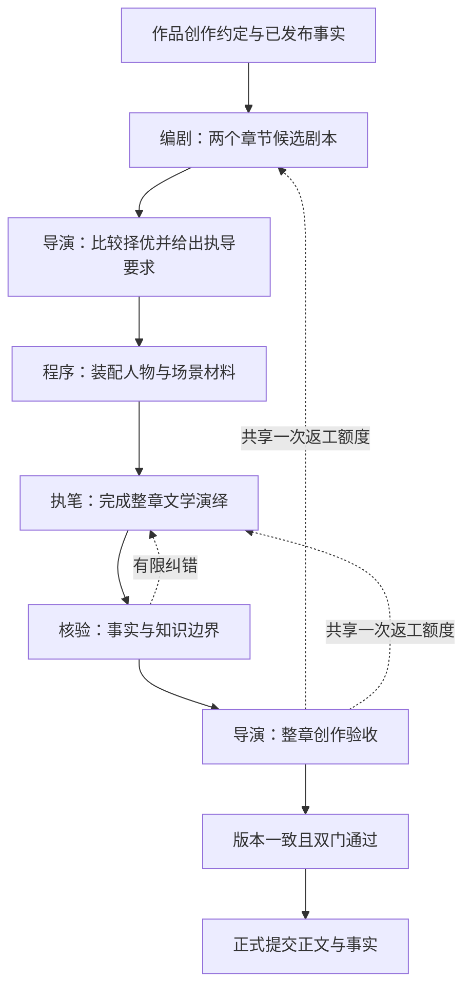

# 导演式小说框架：从电视剧生产到创作系统

**结论与适用范围**

导演式小说值得继续验证，但需要把控制中心从动作结算转移到剧本选择、人物表演和章节整体体验。目标是获得更好的创作取舍，不是把影视剧组的岗位数量复制成模型调用数量。

建议采用“总导演统筹 + 编剧提供候选剧本 + 执笔完成文学演绎 + 独立连续性核验”的框架。总导演负责选本、执导和最终创作验收；预算、恢复、命令合法性和记账由程序负责。每章至少两个有实质差异的紧凑剧本，选定后只制作一个版本；所有创作返工共享章级上限。

本报告依据英国 ScreenSkills、BBC，美国 DGA、PGA 等机构的一手资料，以及当前工作区实现。影视部分用于说明职责和交付物，不作为所有国家、剧种的统一流程或现行合同合规指引；DGA 引用具体为其发布的 2023 协议文本。小说部分是针对项目的设计建议，尚未经新一轮质量实验确认。

本地检查基准为 2026-09-11 工作区，包含未提交改动。相关测试 374 项通过，范围是小说单元测试、小说生成测试及模型提供方测试；不代表全部项目测试、线上部署认证或文学质量验收。没有发起付费生成，没有删除业务代码。

**一、现实电视剧流程，以及需要纠正的类比**

1. **立项与整剧开发。** 制作方和核心主创明确题材、受众、系列方向、资源边界。美国 PGA 对剧集主创职责的说明把 showrunner 列为对整部剧拥有总体创意权和管理责任的角色。因此，本项目长期掌握整书方向的“导演”更接近总创作负责人，而不只是某一集的现场导演。[S1：PGA，剧集制作职责](https://producersguild.org/code-of-credits-episodic-television-scripted/)

2. **故事开发与剧本写作。** 先形成系列、集与人物故事，再把故事变成可制作的剧本。BBC 的从业者访谈说明，两种做法都存在：编剧室共同拆故事，以及主笔给出简要任务、单集编剧发展大纲和剧本。不能把其中一种当作唯一正规流程。[S2：BBC Academy，Writing TV Drama，第 2–3 页](https://downloads.bbc.co.uk/academy/academyfiles/Writing_TV_Drama_BBC_Academy_Podcast_Transcript_%5B230217%5D.pdf)

3. **剧本开发与修改。** 剧本编辑支持编剧，协调制作方、导演等人的意见，并关注场景和集间连续性。导演可以参与剧本修改，但不必自己生产所有剧本。[S3：ScreenSkills，Script editor](https://www.screenskills.com/job-profiles/roles/script-editor-film-and-tv-drama/)

4. **导演准备。** 导演把剧本转化为具体表现方案，与相关主创沟通人物、风格及制作选择。DGA 2023 文本中，剧集导演准备前接收的 working draft 应包括整集人物、地点、对白，明确说仅有大纲不够。这支持“先有可演的剧本，再谈执导”，但没有建立“每集必须多个完整剧本竞选”的行业规则。[S4：DGA，Article 7，7-301/7-302](https://www.dga.org/Contracts/Creative-Rights/Basic-Agreement-Article-7)

5. **选角、场景和美术准备。** 导演与制片、选角及摄影等人员协作，把创意要求交给专业岗位落实；美术设计依据剧本和导演、制片人的构想设计环境。主要角色或场地也可能先于最终剧本确定，因此真实生产不是严格的“选本结束才开始一切”。[S5：ScreenSkills，Director](https://www.screenskills.com/job-profiles/browse/film-and-tv-drama/development-film-and-tv-drama-job-profiles/director-film-and-tv-drama/)、[S6：Production designer skills](https://www.screenskills.com/skills-checklists/scripted-film-and-tv/art-department/production-designer-skills/)

6. **围读、排练与调度。** 可以通过读本、走位和镜头准备检验戏是否成立。DGA 的导演准备工作坊专门训练 blocking 和 shot listing；这些说明导演把文字转成可执行的表现选择，而非只在拍完后评分。围读与排练的范围随制作而异，不应推定每场都有独立完整排练。[S7：DGA，The Director’s Prep: Blocking & Shot Listing，2019](https://www.dga.org/Events/2019/May2019/DDI_Lab_PrepNY-0319)

7. **拍摄与连续性记录。** 表演、画面和声音成为实际素材。场记负责监控动作、对白、时间和情绪连续性，记录不同条次，向后期交接。导演需要这些信息作选择，无须自己承担全部记录事务。[S8：ScreenSkills，Script supervisor skills](https://www.screenskills.com/skills-checklists/scripted-film-and-tv/script-supervisor-department/script-supervisor-skills/)

8. **剪辑与整体成形。** 剪辑师逐步把素材组成场景和全片，导演参与整理成导演剪辑版，随后还涉及制片方批准及画面锁定。导演参与后期不是职责偏离；偏离在于前期失去创作权、后期只剩修错。导演剪辑权也不自动等于最终剪辑权。[S9：ScreenSkills，Editor](https://www.screenskills.com/job-profiles/browse/film-and-tv-drama/post-production/editor-film-and-tv-drama/)、[S4：DGA，7-206](https://www.dga.org/Contracts/Creative-Rights/Basic-Agreement-Article-7)

从这些流程推导出的核心机制是：明确创作意图，先开发可执行剧本，由专业环节提出表达方案，导演在重要节点取舍，最后按整体作品验收。多候选是 AI 系统可以采用的搜索策略，并非照搬行业规定；其收益需要与额外成本一起验证。

**二、哪些影视机制适合小说，哪些会造成新负担**

| 影视机制 | 小说中的对应能力 | 实现边界 |
|---|---|---|
| 系列创作方向 | 类型承诺、主角核心欲望、人物弧线、长线悬念、声音与风格 | 复用作品目标、路径、人物和记忆，不再复制一套事实库 |
| 编剧开发剧本 | 章节候选剧本，写清行动、回应、转折、代价 | 编剧提出故事，不由运行时随机裁定剧情 |
| 导演选本与准备 | 比较剧本，选定阅读效果，标出关键戏及表现要求 | 选择理由短而具体，不要求长篇自评作文 |
| 选角与美术 | 装配角色人格、关系、当前认知、场景空间和关键道具 | 小说人物不是待聘演员；不需要每章重新“选演员” |
| 围读与排练 | 为高风险关键戏试写少量对白与心理动作 | 默认在候选剧本中带短试戏，不另开全员循环 |
| 表演与摄影 | 人物行为、对白、心理、视角、叙述距离 | 由执笔者统合，不再每个岗位一个常驻 Agent |
| 场记 | 角色知识、物品归属、时间地点和已发生事实核验 | 程序加一次语义核验，不拥有剧情创作权 |
| 剪辑 | 章内节奏、场景比重、进入与离开位置、重复删除 | 首版直接形成整章；需要时才局部返工 |
| 成片验收 | 正文整体阅读效果、连续性和篇章承诺 | 创作接受与事实允许提交必须分别成立 |

小说还有影视剧本不能直接提供的部分。BBC 的剧本格式说明强调动作应描述屏幕上发生的事，避免把人物思想写成小说式说明。这正是媒介差别：小说框架必须额外保留有限视角、心理因果、叙述声音、时间压缩和不可靠认知，不能把“摄影机能看到什么”当作全部写作材料。[S10：BBC，Screenplay Format for TV Shows，第 1 页](https://downloads.bbc.co.uk/writersroom/scripts/screenplaytv.pdf)

例如，一个角色怀疑同伴背叛，不等于同伴已经背叛。正文可以写怀疑及其影响；正式事实中应记录“角色产生怀疑”或明确的认知状态，不能把怀疑的内容升级成客观事实。人物可知、叙述可表达、读者当前可知、作者未来计划是四个不同边界。

**三、当前实现与目标的差距**

当前默认是 director_v2@2 的整场协议；director_v2@1 的逐节拍链保留在对照执行器。旧 legacy 执行体已退役。此前提出的修复无进展检测、预算暂停与额度预留也有进一步实现：相邻两轮硬问题集合相同时可以禁止继续改写；REWRITE、RENDER 的后续调用预留分别是 4 和 3。不能继续把这些列作完全未开发。

| 当前位置 | 已核实行为 | 对目标的影响 |
|---|---|---|
| [direction.py：ChapterDirection](C:/regent/core/src/regent/novel/application/direction.py:355) | 一份章节计划，含场景列表，没有章节候选剧本集合和择优结果 | 缺少在写作前比较故事路线的正式环节 |
| [direction.py：plan_chapter](C:/regent/core/src/regent/novel/application/direction.py:1546) | 导演直接生成计划，提示明确“不预写结果和台词” | 不足以构成可演的完整戏剧方案；导演兼任单方案编剧 |
| [direction.py：SCENE](C:/regent/core/src/regent/novel/application/direction.py:1770) | 模型结算事件、状态和关键对白，显式 cast 是名字列表 | 结算者实际上承担剧情与对白创作，却缺少完整角色声音资料的显式交接 |
| [context.py：compile_writer_context](C:/regent/core/src/regent/novel/domain/context.py:176) | 写作者得到可见事件、声纹、叙事要求及记忆；没有结构化交接完整欲望、误判、心理转折 | 并非完全没有人物信息，但人物内在因果需要执笔者再推断 |
| [direction.py：WATCH_PROSE](C:/regent/core/src/regent/novel/application/direction.py:2252) | 导演面对证据、补丁错误、核验报告和剩余额度选 ACCEPT/REWRITE/RETAKE | 创作取舍与修错事务混在一起 |
| [direction.py：validate_chapter](C:/regent/core/src/regent/novel/application/direction.py:2486) | 最后整章关口重点检查连续性、因果、重复与节点完成 | 场景逐一接受后，缺少等价明确的整章创作验收 |
| [generation.py：generate_direction_cards](C:/regent/core/src/regent/novel/application/generation.py:456) | 已有作品开局方向卡供选择 | 这是整书方向选择，不能当成每章多剧本能力；可借鉴交互与版本记录 |
| [generation.py：canon](C:/regent/core/src/regent/novel/application/generation.py:920) | 正式提交检查通过状态与正文 hash，并使用已验证事实 | 是应保留的边界；不应因重构而允许剧本直接入正典 |

当前主要问题是职责间的创作空隙：导演不能提前写结果，结算者决定结果，执笔者又不能新增重大事件。没有一个阶段完整负责“怎样让这件事通过人物选择变成一场好戏”。这是一项结构性风险，不代表每次生成都必然失败。

还有一个迁移时容易遗漏的写入点：`_register_new_personas` 在计划阶段登记计划中使用的新人。如果加入多候选，不能在每个候选生成后复用这个写入过程，否则弃选方案的人物会进入后续上下文。候选角色与背景必须先停留在本次草稿；只有选定版本可以进入制作上下文，最终持久化还要按作品设定与实际正文分别处理。

**四、已有质量实验真正说明了什么**

[实验记录](C:/regent/docs/novel-quality-ab-experiment.md)和[实验实现](C:/regent/core/src/regent/novel/experiments/quality_ab.py)显示，项目并非只做了工程测试。已有最初 A/B/C 九份样本及后续直接写作多轮试验。

首轮系统完成情况为 A 3/3、B 2/3、C 3/3。记录中的后续阅读反馈依次指出：长度不足、主体不清、缺少开场吸引力、代入不足、凑字数、缩短后反而更差。这些是有价值的负反馈，但有三个边界：

- B 是在实验模块中另写的简化镜像，并未直接运行生产 `produce_tick`。其结果可以评估简化流程，不能直接认定生产版本在真实状态与恢复路径下的完成率。
- 后续多轮主要修改 A，开场、字数、钩子、代入等约束发生变化。不同轮次不能继续当作同一条件下的 A/B/C 对照。记录里对实验路线的最新纠偏应保留：A 是基线，不是必须先成功才能测试导演方案的前置条件。
- `quality_ab.py` 的费用是按 token 粗估的实验单位，并非模型账单。小样本结果、文档中的阅读反馈和系统 completed 标记均不能直接推出真实业务成本或稳定偏好胜率。

目前支持的判断是：增加长度和提示要求没有稳定解决问题；流程通过与阅读质量脱节。尚未被试验的关键假说是：有差异的完整剧本方案能否增加优质故事供给，以及导演能否选中真正更好的方案。

**五、建议的最小框架**

图中的回路不是每阶段各得一次无限叠加机会。建议试验初值为：每章两份候选、一份最终正文、全章一次创作返工。技术性重试由模型调用层统一有界处理并计入总预算，不能借换阶段重置创作返工额度。次数是待验证的成本策略，不是行业规律。

只保留四种职责，不要求四个模型或四个独立服务：编剧、导演、执笔、核验。上下文装配、调用额度、状态转换、版本和入库仍是普通程序。

**1. 作品层：定义什么值得写**

沿用既有作品目标与人物资料，投影出简短创作约定：目标读者和类型预期、主角长期欲望及盲点、作品独特机制、叙述声音、近期尚未兑现的承诺、已锁定与可变化的剧情边界。加入少量经作者认可的正反例，帮助导演形成一致取舍，而不是只重复“悬念强、代入强”。

这些是已有资料的整理和质量锚点，不新增一套世界图谱。首次章节需要“独立成立的开场”任务，续章需要“承接上章并推进既有承诺”任务，不能对每章机械套同一种爆点要求。

**2. 章节候选：必须是紧凑剧本，不是标题和口号**

每章产出两个候选。每个候选应包括：起点与结尾变化、人物目的及反对力量、按顺序发生的行动与回应、关键转折及其原因、关键对白或短试戏、主角当时知道什么及如何权衡、应兑现和新提出的阅读问题。

候选必须说明故事如何走完本章；不能只有“制造冲突，最后反转”。它不需要镜头号、全量道具表或完整小说语言。可先以约 500–900 字作为紧凑剧本的试验预算，其中关键戏占一小部分；字数只控制成本，完整性和可演性由内容判定。

两份候选共享人物与已发布事实，但采用不同的因果路线。可以由同一编剧职责的两个受控请求产出；第二份不必读第一份，以减少相互模仿。给两份不同的创作任务，比仅更换随机种子更可解释。模型数量不是候选多样性的证明。

**示例：同样是“修表师得到父亲失踪线索”。**

- 剧本甲：来人用修表费用试探主角，主角识破交易中的假信息，必须抵押唯一的父亲遗物才能拿到见面地点；代价与信任抉择在交易中发生。
- 剧本乙：主角从维修单上发现父亲笔迹，认出有人刻意引他调查；为保护已经被盯上的熟人，他主动销毁能证明自己的证据，从而获得更危险的追查机会。

两者只是说明候选差异的原创示例，实际仍须服从作品既有设定。关键差异在行动、代价和关系后果，不在描写词汇。

**3. 导演择优：判断供给，也判断是否值得制作**

导演同时看到匿名候选、创作约定与事实边界。先判断是否存在不可成立的因果或越界，再比较：哪份最能让读者站在主角位置做选择，哪份冲突更具体，哪份兑现了类型承诺，哪份为后续留下可持续的变化。

输出一个选中 ID、简短取舍理由、该稿最危险的弱点、必须拍好的关键戏和允许发挥的范围。不让候选附带“本方案更精彩”的自评分；不默认排名第一项就是胜者；两份都不成立时允许退回，并消耗共享返工额度。混合两稿属于新的编剧修订，不能把两个结尾直接拼接。

导演也需要被评估。模型裁判研究已观察到顺序、冗长和自我偏好等偏差；这不能证明本项目必然发生同样问题，但足以支持匿名、换序和人工校准，而不是把选中结果直接当真值。[S11：Zheng 等，NeurIPS 2023](https://papers.neurips.cc/paper_files/paper/2023/hash/91f18a1287b398d378ef22505bf41832-Abstract-Datasets_and_Benchmarks.html)

**4. 制作准备与演绎：有戏可演，有人可进入**

程序按选中剧本装配本章相关人物的身份、欲望、底线、关系、声纹、当下认知和允许呈现的心理材料；场景材料只包含影响选择与空间行动的背景、物品和限制。编剧需要的故事环境与演绎需要的感官细节可以在不同阶段补充，不能等所有背景都写完才开写。

常规章节直接由执笔者完成整章，保留章内统一声音与比例。关键对手戏可在剧本内提供短试戏；只有判断确有必要时才单独排练，并占用预先分配的预算。无需每章让每个人物逐轮说话，再把对白汇总成事件。

执笔者拥有对白措辞、微动作、心理推进、叙述顺序与详略的创作空间。剧本中的核心选择与结果是本次创作承诺，但不是已经发生的客观事实；若演绎中发现核心因果不成立，返回一项明确的修改申请。微小文学细节不需申请，新增能力、改变死亡状态或泄露秘密等重大变化不能悄悄通过。

**5. 最终质量责任：导演看整章，核验器守边界**

核验器检查已发布事实、角色认知、关键因果及稿中新增事实是否有正文依据；导演看主角是否可理解、人物是否有区别、关键戏是否真正发生、铺垫与兑现是否匹配、结尾是否产生阅读动力。导演要能删掉合格却无用的场景，并据问题归因选择改剧本或改表达。

事实错误是禁止提交的条件；审美未达标是创作不接受的条件。两者分别留痕，避免把模型的文学意见伪装成硬事实。整章接受不能仅由各场接受自动推导出来。

程序提交前核对正文 hash、剧本版本、核验版本和导演接受版本一致。一旦正文再修改，旧核验和旧接受均不能替新稿背书。没有事实硬错但导演不满意时，也不能为了完成率默默把草稿标成已完成。

**六、容易遗漏且必须定义的边界**

| 遗漏 | 建议约定 |
|---|---|
| 总导演只看本章，长线越来越散 | 读入近期承诺与人物弧线；未锁定远期路线可改，作者锁定项必须遵守 |
| 多稿只是同一情节换名字 | 为候选提供不同的行动与代价任务；记录差异，不凭标题判断多样性 |
| 剧本精彩，正文空洞 | 候选包含关键戏；导演保存必须兑现的阅读效果，最终以正文验收 |
| 选稿者审美不准 | 对比导演选择与匿名读者选择，测量选中优于随机/固定首稿的比例 |
| 人物“表演”变成口头声纹 | 同时提供关系、认知、欲望与心理代价；声纹只是其中一部分 |
| 写作者知道秘密就自动写出秘密 | 分离制作材料的可知与正文可披露；核验明确检查叙述泄露 |
| 假想、谎言、传闻混入正典 | 分开正文表达、角色信念与客观事实，提取时保留主体和置信语义 |
| 弃选剧本污染后续 | 草稿隔离；人物、场景和预测状态不写正式世界账本 |
| 每场都好看，整章仍拖沓 | 设置整章导演验收，允许合并、压缩、提前结束；不机械均分字数 |
| 每章都强悬念，长期疲劳 | 允许兑现、关系变化和舒缓；下一章动力不必始终依赖惊吓或生死危机 |
| 纠错只重演三章，却把后面视作一致 | 成本窗口不等于影响范围；窗口外的后续依赖应明确待复核/失效，不能宣称整书已修复 |
| 一次返工跨多个阶段变成多次 | 使用同一章节的创作返工账；技术恢复不刷新创作次数 |
| 提案用完预算，正文没钱写 | 候选成本有上限，提交后续预算在择优前预留；不得自动追加额度 |
| 把字数当成质量 | 字数仅防空稿、限制篇幅；记录读者兴趣与信息重复，不以越长越好晋级 |

知识隔离、版本提交、预算和恢复已经有代码基础，应复用。未确认的跨章窗口问题应补专项验证，不能只因有三章上限就直接认定现有系统一定传播错误。

**七、当前偏离部分的删除与保留清单**

以下是迁移目标，不是允许立即删库或中断在途运行的指令。

| 能力或代码 | 建议 | 原因与删除条件 |
|---|---|---|
| 默认写前 `SCENE` 事件结算 | 新协议中删除其创作主导职责 | 编剧负责计划事件；正文产生实际事实；结算检查变为剧本可行性/正文核验，不再替编剧决定故事 |
| `ACT → RESOLVE → WATCH_TAKE`、Hive、ActorTurn、TakeDirection | 退出产品运行链，必要时留离线历史参照 | 当前已非默认；待旧协议运行清空和兼容策略确定后，才移除生产分支及其专属调用 |
| 导演从命令全集反复猜合法操作 | 从导演任务中删除 | 程序按状态给出少量可用创作操作；非法 ID 或越界参数由调用层有界处理 |
| 导演审美意见必须精确引文并自修 | 去掉作为创作意见的硬准入门 | 使用场景/段落 ID 加短理由；事实核验的正文依据仍保留 |
| 每阶段分别修复、重演、章节回退的独立创作额度 | 合并为章节共享返工额度 | 保留有限修订能力；不让层级叠加吞光资源 |
| 场景逐一 ACCEPT 作为默认制作循环 | 短章新协议以整章接受替代 | 保留场景编号、局部修改和检查点，不逐场再建导演决策往返 |
| 段落补丁、base hash、旧稿版本 | 保留底层能力，取消模型必填的日常事务 | 小改使用补丁，大幅创作修订可产出新整章版本；两种都重新核验 |
| `plan_replay` 与最小依赖子图生产承诺 | 删除过时承诺；无业务引用的实现可归档 | `plan_local_replay` 已改保守章窗口。不能因此删除历史表或现用失效机制 |
| 固定每场平分字数 | 改为剧本/导演给篇幅侧重 | 关键戏与过渡戏不该获得一样的展开空间 |
| 实验中的不断叠加提示和动态质量门 | 冻结旧版本，另建固定协议 | 历史失败应保留，停止改完门槛再与旧结果混比 |
| 自动扩卷、精细图谱、长篇分级试跑等外围扩展 | 暂停扩建，不为精简破坏现有用户约定 | 先证明数章阅读收益，再投入长篇优化 |
| CallBroker、计费、流式接收、幂等、租约、暂停恢复 | 保留 | 属于运行可靠性，不是导致故事平淡的创作职责 |
| 事实证据、认知边界、用户锁定节点、hash 绑定提交 | 保留并贯穿新链路 | 删除这些会把质量问题变成事实污染和用户控制失效 |

`domain/context.py` 中人物私有视角投影仍可能服务有界试戏，不能随 Hive 整文件误删。`prose_patch.py` 和 `scene_requirements.py` 的有效校验逻辑也不应与旧执行拓扑一起丢弃。

**八、实施顺序与验收条件**

**阶段 1：冻结基准和职责，不新增生产开关。**

保存当前源码指纹、模型标识、完整提示版本、任务契约、采样设置及费用计量方式。整理现有实验反馈，清除主计划中与最新版本矛盾的“已完成/待实施”描述，但保留历史证据。明确编剧、导演、执笔、核验四种职责和草稿/正式事实边界。

**阶段 2：只实现一个纵向实验切片。**

复用现有实验落盘和计量工具，增加“两个剧本 → 导演选本及执导 → 人物/场景装配 → 整章正文 → 核验 → 导演接受”的协议。候选和选择结果是必要新产物，先存入版本化运行产物，无须先新建一批业务表、消息总线和 Agent 服务。

**状态（2026-09-11）：** 实验协议 `S`（`script_select_then_write`）已与生产对照臂
`director_script` / `director_script@1` 共用
`core/src/regent/novel/domain/script_protocol.py`（候选差异化、装配与弃选隔离）。
生产默认仍为 `director_v2@2`；仅当 `NOVEL_EXECUTOR_CANARY=director_script` 时新运行可钉
`director_script@1`。灰度默认 0%。不自动扩流量。

实验初值可按两次候选、一次导演择优、一次正文、一次核验、一次导演验收计算，即无返工约六次模型调用；程序装配不调用模型。这个调用数不等于成本承诺，必须另设 token、时间与实际费用上限。编剧返工和正文返工共用一次机会，失败保留结果，不自动补齐成功数。

**阶段 3：验证三个不同的假说。**

第一，候选中有没有读者认可的故事；第二，导演能否选中它；第三，选定剧本能否变成有阅读动力的正文。不能把三者混成一个“生成成功率”。

先用三个固定章节任务筛选方向，覆盖开场、续章关系推进和承诺兑现；每任务运行固定次数并记录全部失败。至少保留直接写作基线、当前事件优先链、新剧本择优链，输入契约与总费用上限一致。若资源紧，可先比较当前链与新链，但明确未测直接基线。费用上限相同不要求强行花完；同时报告实际使用量。

为识别择优的价值，还应在小部分样本用相同执笔协议呈现两个候选，对比导演所选正文是否比未选正文更受欢迎。这样可以区分“编剧产不出好戏”“导演选错”“执笔丢失效果”。这笔诊断成本必须预先计入实验预算，不进入每章生产常规流程。

读者看匿名正文，评价是否愿意继续、能否站在主角位置做选择、人物行为是否可信、是否有明显冗余。记录中立与均不喜欢，失败不从统计中删掉。导演对剧本的选择另作一项评价，不能用选稿得分替代正文评价。

三任务只是发现明显方向问题的 pilot，不足以宣布稳定获胜。通过初筛后，用未参与调提示的任务和不同读者扩样；晋级阈值、预算和停止条件在运行前冻结。若优稿根本不存在，改善编剧任务与题材设计；若优稿存在但选不出，校准导演；若稿好文差，改善人物和叙述交接。不要再把所有失败归结为“多加一次反思”。

**阶段 4：有阅读收益后才迁移生产。**

**状态（2026-09-11）：** 对照臂已接线（`director_script@1`），**尚未**替换 `STABLE_EXECUTOR`。
新协议单独固定身份，不在已有在途运行中偷偷改阶段语义。新运行走新协议，旧运行按旧版本完成或明确终止；历史正文与账目只读保留。验证候选隔离、重启恢复、版本一致核验、预算暂停、有限返工、事实提交和跨章承接后，再逐步移除旧演绎分支。

删除验收应包括业务调用引用、旧运行数量、必要历史解析入口和相关回归。测试应证明目标行为与失败边界，不继续维护只验证旧命令拓扑存在的测试。不得以“测试数量更多”替代读者评价，也不得因为追求代码更短而删除幂等记账或正式提交保护。

**九、最终架构决策**

采用“剧本先行、导演择优、人物与叙述一体演绎、整章验收”的方向，保持总导演跨章负责。删除新协议里逐动作自治与写前事件裁定的主导地位；保留轻量事实核验和现有可靠性底座。

导演的责任应该体现在可追踪的创作决定：为什么选这个故事、准备怎样表现、成稿是否实现了目标、未实现时该改哪里。导演不需要亲自维护账本和命令协议，也不能只替核验器宣布放行。框架是否成功，最终取决于这种取舍是否以可接受的成本提高读者的阅读意愿。

**来源与证据索引**

- S1：Producers Guild of America，Producing Credits for Episodic Television (Scripted)，[原文](https://producersguild.org/code-of-credits-episodic-television-scripted/)。用于整剧创意统筹职责。
- S2：BBC Academy，Writing TV Drama，2017，访谈文字稿第 2–3 页，[原文](https://downloads.bbc.co.uk/academy/academyfiles/Writing_TV_Drama_BBC_Academy_Podcast_Transcript_%5B230217%5D.pdf)。用于不同编剧开发路径；历史从业资料。
- S3：ScreenSkills，Script editor，页面未标出版日期，[原文](https://www.screenskills.com/job-profiles/roles/script-editor-film-and-tv-drama/)。用于剧本开发与意见协调。
- S4：Directors Guild of America，Basic Agreement of 2023, Article 7，[原文](https://www.dga.org/Contracts/Creative-Rights/Basic-Agreement-Article-7)。用于剧本交付及导演创作权边界，不推定适用所有制作。
- S5：ScreenSkills，Director (Film and TV Drama)，页面未标出版日期，[原文](https://www.screenskills.com/job-profiles/browse/film-and-tv-drama/development-film-and-tv-drama-job-profiles/director-film-and-tv-drama/)。用于导演与其他部门协作。
- S6：ScreenSkills，Production designer skills，页面未标出版日期，[原文](https://www.screenskills.com/skills-checklists/scripted-film-and-tv/art-department/production-designer-skills/)。用于环境设计与剧本的关系。
- S7：DGA，The Director’s Prep: Blocking & Shot Listing，2019，[原文](https://www.dga.org/Events/2019/May2019/DDI_Lab_PrepNY-0319)。用于导演准备的实际内容。
- S8：ScreenSkills，Script supervisor skills，页面未标出版日期，[原文](https://www.screenskills.com/skills-checklists/scripted-film-and-tv/script-supervisor-department/script-supervisor-skills/)。用于连续性及后期交接。
- S9：ScreenSkills，Editor (Film and TV Drama)，页面未标出版日期，[原文](https://www.screenskills.com/job-profiles/browse/film-and-tv-drama/post-production/editor-film-and-tv-drama/)。用于素材组接和整体验收。
- S10：BBC，Matt Carless，Screenplay Format for TV Shows，第 1 页，[原文](https://downloads.bbc.co.uk/writersroom/scripts/screenplaytv.pdf)。用于影视动作说明与小说心理叙述的媒介差异。
- S11：Zheng 等，Judging LLM-as-a-Judge with MT-Bench and Chatbot Arena，NeurIPS 2023，[原文](https://papers.neurips.cc/paper_files/paper/2023/hash/91f18a1287b398d378ef22505bf41832-Abstract-Datasets_and_Benchmarks.html)。用于裁判偏差的设计风险，不将研究数据外推为本项目效果。
- 本地依据：[当前导演实现](C:/regent/core/src/regent/novel/application/direction.py)、[上下文装配](C:/regent/core/src/regent/novel/domain/context.py)、[执行器版本](C:/regent/core/src/regent/novel/application/executor.py)、[记忆与重演](C:/regent/core/src/regent/novel/application/memory.py)、[质量实验记录](C:/regent/docs/novel-quality-ab-experiment.md)、[实验程序](C:/regent/core/src/regent/novel/experiments/quality_ab.py)、[首轮统计](C:/regent/deploy/novel/artifacts/quality_ab_live/summary.json)。

网络资料检索日期：2026-09-11。部分 ScreenSkills 页面全文打开受访问限制，相关表述依据检索工具返回的该机构页面内容；未据此补写未见的工作细节。
