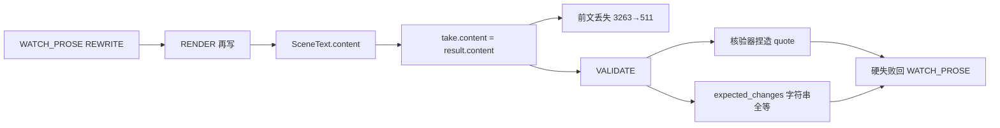
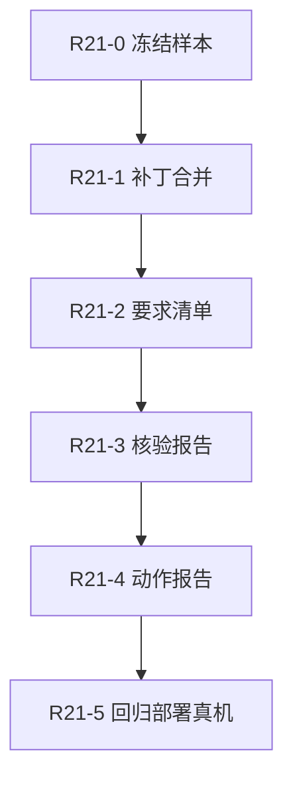

# run21 修复计划（最终）

版本：1.2（实施后复核）；日期：2026-09-10；状态：主体已实施，边界修复及联合验收待完成。

最新状态以 [v7.11 复核与下一批计划](archive/r21-repair-review-next-plan.md) 为准：保留 run5 补丁路径和 run6 成章成果，重新打开空核验报告、非连续补丁、属性要求与同次运行联合验收。以下原始任务说明保留供追溯。

依据：[run21 复检](archive/run21-review-2026-09-10.md)；总计划：[Novel-Engine-Plan.md](../Novel-Engine-Plan.md) v7.10。

本计划关闭生成阻塞：**局部修订丢前文**、**修订指令与结算冲突**、**核验伪造证据**、**状态字符串误判**。执行顺序固定为 R21-0 → R21-1 → R21-2 → R21-3 → R21-4 → R21-5。不得仅凭新增字段、单测通过或单次模型成功关闭整个批次。

---

## 固定约束（全批次）

| 约束 | 说明 |
|------|------|
| 导演决定 | 代码不把 REWRITE 自动改成 RETAKE；ACCEPT 在硬失败下永不放行 |
| 硬门保留 | 伪造引文、事实矛盾、越权披露仍拒绝；不放宽为模糊匹配 |
| 预算不变 | 不抬高 `MAX_REVISIONS` / `MAX_TAKES` / 总成本上限来掩盖问题 |
| 补丁优先 | 局部修订走结构化补丁；完整场景仍返回完整正文；禁止自然语言猜截取位置 |
| 报告自修 | 核验报告格式自修至多一次、计入同一调用预算；额度不足返回可诊断失败 |
| 不回滚 | 不撤销 D-11～D-16；不改产品收费、公共阅读、长篇认证门槛 |
| 关闭标准 | 固定反例全过 + 冻结配置真实首章可接受；单次成功 ≠ 整体质量认证 |

---

## 根因与代码锚点（复检已确认）

| 错因 | 机制 | 主文件 |
|------|------|--------|
| 局部输出整场覆盖 | `take["content"] = result.content.strip()` 无合并 | [`direction.py`](../core/src/regent/novel/application/direction.py) RENDER ~1561 |
| 首写/改写同一 schema | 仅 `SceneText.content`；无 patch | 同文件 `SceneText` ~251 |
| Writer 只见可见事件 | `compile_writer_context` 过滤 `reader_visible` | [`context.py`](../core/src/regent/novel/domain/context.py) ~199 |
| 期望状态含隐藏事件 | `expected_changes` 扫全部 `take["events"]` | `direction.py` VALIDATE ~1675 |
| 状态身份脆弱 | `dict[str,str]` 后写覆盖 + 全等比较 | `SceneEvent.state_changes` / VALIDATE |
| 核验捏造无自修 | VALIDATE 不走 `_grounded_judgment`；假 quote 只记 issue | VALIDATE 分支 |
| 动作报告二元 | `_legal_action_report` 缺 brief 的 RETAKE =「不可执行」 | `direction.py` ~678 |

运行证据：远程最新失败 `e85633cb-6433-4361-8d98-7db0cf508485`（TERMINAL_FAILED/WATCH_PROSE；与交接 run21 特征一致）。自修 `input_hash` 已变，**不是**「temperature=0 + 输入不变」。

---

## R21-0：冻结失败样本与可重放基线

**产出**（仓库内脱敏 fixture，测试不连远程）：

- `tests/fixtures/novel/run21/`（或等价路径）manifest：运行 id、take 标识、对应依据（时间+失败特征，不凭文件名）
- 三版正文全文 + sha256（1170 / 3263 / 511）
- 全部事件与 `state_changes`、导演 `revision_instruction`、核验 `SceneValidation` 原始输出
- 请求版本、模型与采样配置快照

**必须保留的三个独立反例：**

1. 3263 字整稿被 511 字后半段覆盖（协议/合并错误）
2. 导演要求删除已结算拆解动作（修订越事件边界）
3. 核验器引用当前正文不存在的句子（报告错误）

**验收：** 离线重放能复现三类失败并标注责任层；记录定向基线 316 passed（不宣称全仓绿）。

---

## R21-1：局部改稿交付与合并契约（首个实施切片）

**目标：** 局部修订后，未声明修改的段落逐字保留；VALIDATE/ACCEPT 只针对合并后的完整稿。

### 设计（已定）

1. **两种 Writer 输出模式**
   - `full`：`SceneText`（或等价）返回完整场景正文——首次 RENDER 与显式「完整重写」使用。
   - `patch`：结构化补丁——局部 REWRITE 使用。字段至少：`base_content_hash`、`replacements: [{paragraph_ids | range, text}]`、修订目的（可选）。
2. **段落标识**
   - 进入局部修订前，对当前 `take["content"]` 按稳定规则切段并分配 `paragraph_id`（仅协议，不写入读者正文）。
   - 冻结 `base_content_hash = sha256(当前完整稿)`；非连续范围显式列出。
3. **合并为纯函数**（优先独立模块，便于单测与变异）
   - 输入：base 全文、段落表、补丁
   - 校验：hash 一致、id 已知、无重叠、不越界、类型正确
   - 输出：合并全文；未命中段落字节不变
   - 失败：不覆盖 `take["content"]`；走有界 Writer 自修 + 统一调用账本
4. **禁止**
   - 不得把部分文本当整场覆盖
   - 不得从「保留前面」等自然语言推断截取点
   - 不得在补丁失败时静默降级为完整覆盖
5. **落库**
   - 每次保存：输入稿 hash、补丁、合并稿、模式；`prose_versions` 追加**合并后完整稿**
   - 字数骤减只作诊断信号，不作文学质量硬门

### 触及文件（预期）

- [`direction.py`](../core/src/regent/novel/application/direction.py)：`SceneText` / 新补丁模型、RENDER 分支、REWRITE 时冻结段落表与模式
- [`context.py`](../core/src/regent/novel/domain/context.py)：Writer payload 增加 `revision_mode`、`base_content_hash`、`paragraphs`、可编辑范围
- 新建纯函数模块（建议 `novel/domain/prose_patch.py` 或 `novel/application/prose_merge.py`）
- 测试：`tests/unit/novel/test_r21_prose_patch.py`（含 run21 前半段逐字保留）
- 反证：`deploy/novel/mutate_check_r21_1.py`（删 hash/range 校验、恢复直接覆盖 → 目标测变红）

### 验收

- [ ] run21 样本局部修订后，开盖前段落与 3263 字版对应段逐字一致
- [ ] 正文内重复段落不导致错位合并
- [ ] 过期 hash / 未知 id / 重叠范围被拒且旧稿保留
- [ ] 显式完整重写仍可用，且仍按同一事件要求进入后续核验
- [ ] 对应变异正交失败

**本切片不做：** requirement 清单（R21-2）、核验报告自修（R21-3）、动作三分法（R21-4）、真机跑章（R21-5）。

---

## R21-2：统一事件与状态要求清单

**目标：** 执笔、修订、核验共用同一份可追踪 `requirement` 列表。

1. 冻结带版本的 `requirement_id`：绑定 `event_id`、实体/属性、预期值、叙事可见性、是否要求本稿直接证据。标识由结算冻结数据确定，Writer 不得发明。
2. Writer / 修订 payload 增加 `must_preserve`（可见且需证据的关键动作与最终状态）；修订指令与已结算事件冲突时**显式回报导演**（精简允许；消除成立依据 → 须 RETAKE）。
3. 状态身份：分离属性后按事件顺序归并最终值；**自然语言 value 不承担精确身份比较**。同义表达仅作解释；不得用模糊相似度放行矛盾。旧 `dict[str,str]` 需显式适配层，禁止字符串切割猜属性。
4. 区分中间态与最终态：不要求正文同时保持被后续覆盖的相反值。隐藏事实留在世界状态与权限检查，不要求 Writer 披露。
5. 协议版本钉在 take/run；旧场景按原契约恢复，新契约只在新尝试启用。

**验收：** 同义不误杀、真缺失仍失败；同实体多属性不丢；隐藏不喂 Writer；run21 修表/打烊/拆解等有可追踪要求。另补「隐藏事件进期望但不进 Writer」的独立测试。

---

## R21-3：核验报告可定位、可修复、不伪造正文

**目标：** 区分「报告无效」与「正文缺失」；假引文不强迫 Writer 补写。

1. 每个 `requirement_id` → `supported | contradicted | missing` + 当前正文 quote/位置，绑定本次 `content_hash`。
2. 代码硬检：格式、id 覆盖/重复、quote 是否在**当前**合并稿、范围与 hash。缺 id / 重复 / 伪造引用 → **报告无效**，不得自动认定正文缺失或通过。
3. 报告无效：具体错误 + 当前稿回传核验器，**最多自修一次**（计入同一预算）。有效的 missing/contradicted 交导演 REWRITE/RETAKE。
4. quote 存在只是必要非充分：须支持对应状态（不能用「开盖句」证明「拆下秒轮桥」）。

**验收：** 三条不存在引文被定位；真遗漏仍拒；不同正文版本不复用旧核验；报告自修可不改正文即纠正；预算/幂等有测。

---

## R21-4：合法动作提示三分法（不代替导演）

**目标：** 报告可读、可行动；决定权仍在导演。

| 档位 | 含义 | 例 |
|------|------|----|
| 直接可执行 | 当前载荷下 `_validate_action` 通过 | 有预算的 REWRITE |
| 补参后可执行 | 缺/未改 `revised_brief` 等 | RETAKE 需不同 brief |
| 禁止 | 预算/硬失败/阶段规则 | ACCEPT+硬失败；REWRITE 次数用尽 |

1. 改 `_legal_action_report` 探测策略（合成合法载荷二次 probe）；拒因分层，避免字符串凑合。
2. 首次决策与每次自修均给：剩余 revisions/takes/成本、真实缺失项、合法条件；反馈继续累积。
3. 仍可 RETAKE 时明确要求有效新 brief + 改变理由；全部不可执行 → 可诊断失败，不重复无解决定。

**验收：** 硬失败下 ACCEPT 永拒；重写耗尽仍可提交有效 RETAKE；缺/同 brief → 参数档；无预算不调模型。不以调 temperature / 加次数作为通过条件。

---

## R21-5：回归、反证、部署与真实章节

1. 每批：行为测 → 小说域 + model SSE + context/Runtime + 账本恢复；隔离变异，目标红且正交绿。
2. PowerShell 查进程退出码；Bash 管道须 `pipefail` + `${PIPESTATUS[0]}`。
3. 保存源码/提示/fixture/模型采样/迁移 manifest；新持久字段才加迁移。
4. `sync_tree.py` 部署 + 容器 sha256；先离线重放 run21，再冻结模型与相同预算跑真实首章。
5. 预先固定 **3** 次真机跑用于稳定性观察，**逐次报告、不挑成功样本**；合法预算终止单列，不算章节成功。
6. 每次记录：补丁范围、要求覆盖、核验报告修复、修订/重演次数、费用、终态。失败按类型回对应批次，不靠改导演提示掩盖他层错误。

**关闭条件：** 固定反例全过；真机前文不丢、硬失败不接受、结算与正文一致、无信息泄露、预算与恢复守恒，并成功接受完整章节。保留 R3/M2/R4/M4 与人工验收未完声明。

---

## 批次依赖与交付节奏

| 切片 | 可独立交付？ | 说明 |
|------|--------------|------|
| R21-0 | 是（只读+fixture） | 实施前必须完成 |
| R21-1 | 是 | **下一次动手的首交付**；即可挡住丢前文 |
| R21-2 | 依赖 R21-1 合并稿语义 | 清单对着完整稿 |
| R21-3 | 依赖 R21-2 ids | 按 requirement 出报告 |
| R21-4 | 可与 R21-3 小幅并行，但验收放其后 | 避免用提示掩盖核验bug |
| R21-5 | 全部前置绿后 | 真机关闭门 |

---

## 本次交付边界

本文件为最终实施计划（v1.1）。**R21-0～R21-5 已闭合**（含 R21-1b / 5a / 5c）。

- 补丁真机：run5 `last_patch` + 前缀保留
- 预算修复：SUPERSEDED 不占 `MAX_TAKES`；章回废后续场全部 take
- 成章：run6 CANONIZED
- 测试：R21 协议测 + 4 变异；记录见 [r21_ch1_summary](../deploy/novel/artifacts/r21_ch1_summary.md)

R3/M2/R4/M4 与人工验收仍开放。
