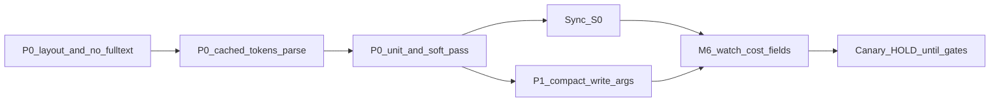

# Token / Prompt Cache 成本修复计划（产品 + 技术联合，2026-08-01）

> 状态：IMPLEMENTED（P0 布局 + cached_tokens + P1 write_file compact；待生产观察命中率）  
> 触发：生产/canary 下 token 命中率极低、常规项目重复计费过分  
> 关联：审计 D6/D7/D9（`docs/agent-core-restoration-plan-2026-08-01.md`）、M6 canary 观察窗  
> 约束：不为省 token 牺牲「可运行 Preview + 真实闭环」；不提高 temperature / 盲目加 max_tokens / 加 Agent 数

---

## 1. 联合结论（一句话）

**不是模型「不聪明」或项目「不常规」，而是每轮把易变 workspace 全文塞进 prompt 前缀，主动拆掉 prefix cache，导致 within-run 几乎全额重计费。**  
必须先改消息布局止血，再压缩历史，再补 `cached_tokens` 观测；修完前建议 **维持 5% canary、不扩流量、不谈 GQ-4**。

---

## 2. 产品经理视角

### 2.1 影响

| 维度 | 影响 |
|---|---|
| 成本 | 多轮 agentic（常 20–40 turn）× 每轮数万 input → 单 Goal 成本数量级偏高；canary 一开，账单会被少数 agentic Goal 拖垮 |
| 用户价值 | 钱花在重复前缀上，不转化为更好的 Preview/修复质量 |
| Canary 决策 | 当前成本信号失真：分不清「模型贵」还是「拼装浪费」→ 无法公平对比 artifact-backed vs agentic |
| 风险 | 若用降质量手段省 token（少写文件、跳过 verify）→ 假绿，伤害 M6 出口 Gate |

### 2.2 可接受 tradeoff

| 可接受 | 不可接受 |
|---|---|
| Agent 用 `read_file` 按需读，而不是每轮 dump 全文 | 为省 token 跳过 smoke / Preview / submit |
| 旧 tool 结果与旧 write 参数被压缩，可从 workspace 重读 | 压缩后丢失「当前失败原因 / 未解决 gap」 |
| 单轮上下文变「瘦」，总轮数略增但总 token 下降 | 提高 temperature、加修轮次、加 Agent 当「修复」 |
| 观测先准再优化 | 看不见 `cached_tokens` 却宣称已修好 |

### 2.3 优先级（产品）

1. **立刻（P0）**：改拼装顺序 + 去掉每轮全文 dump（成本止血，质量中性或更好）  
2. **并行（P1）**：压缩 write_file 参数 / 强化 compact（降膨胀）  
3. **并行（P0.5）**：解析并上报 cache 命中（决策可信）  
4. **观察窗**：M6 保持 5%；成本护栏未过前 **禁止 EXPAND_10 / GQ-4**

### 2.4 成功指标（产品护栏）

**成本侧（相对修前同模型同任务窗）：**

- within-run `cached_tokens / prompt_tokens` 中位数：**≥ 40%**（P0 后）；目标 **≥ 60%**（P1 后）  
- 单 turn `prompt_tokens` 中位数：**下降 ≥ 50%**  
- 单 Goal（达 submit 或等价轮次）总 input tokens：**下降 ≥ 40%**

**质量侧（不得恶化）：**

- soft-pass / first_runnable / preview_ready 不低于修前同窗对照  
- 无新增「无 changeset 却宣称成功」  
- M6 出口四指标定义不变

### 2.5 对 M6 / GQ-4 的门禁建议

- **现在**：保持 5% canary；日更探针增加粗成本字段（总 prompt_tokens）  
- **P0 合入并验证前**：不扩 10%  
- **P0+P1 达标且质量护栏未破**：才允许讨论 EXPAND_10  
- **GQ-4（默认 agentic）**：本计划范围内 **明确不做**

---

## 3. 技术专家视角

### 3.1 根因分层

```text
Layer A  Within-run prefix cache（主战场，占浪费大头）
         每轮 user_blob 前缀含 workspace/todos → 前缀字节变 → cache miss
Layer B  Conversation 膨胀
         write_file 全文留在 assistant.tool_calls.arguments；micro_compact 只清 tool role
Layer C  Cross-run / 跨 Goal
         新 Goal 新对话；常规脚手架未形成稳定跨请求长前缀（次要，P2）
Layer D  观测缺失
         provider 不解析 cached_tokens → 命中率「看起来永远是 0」
```

核心代码：

- [`context_assembler.py`](core/src/regent/agent/context_assembler.py) `assemble()` / `_workspace_segment()`  
- [`compact.py`](core/src/regent/agent/compact.py) `micro_compact()`  
- [`agent_runner.py`](core/src/regent/agent/agent_runner.py) 每轮 `assembler.assemble` + `micro_compact`  
- [`provider.py`](core/src/regent/model/provider.py) / [`chat.py`](core/src/regent/model/chat.py) usage

### 3.2 推荐消息布局（P0）

**目标：稳定前缀尽可能长且跨 turn 字节稳定；易变只放后缀。**

```text
[1] system                    # 静态规则（极少变）
[2] user: static_anchor       # goal + skills + REGENT.md +（可选）planned_paths
                              # 同一 Run 内不重排、不重注易变段
[3] ...conversation...        # assistant/tool 历史（可 compact）
[4] user: turn_delta          # 仅本轮增量：tree 摘要 / todos diff / gaps / goal reminder
```

规则：

- **禁止**把「近 N 个文件全文」放进 static 前缀  
- workspace 默认只给 **路径树（短）**；文件内容靠已有 `read_file` 工具  
- goal reminder：改为插在 **turn_delta 后缀**，不要改 static 前缀  
- 同一 Run 内 `static_anchor` 文本应 **hash 稳定**（可用断言测）

### 3.3 分阶段修复

#### P0 — 止血（预计 0.5–1 天工程）

| # | 动作 | 文件 |
|---|---|---|
| P0-1 | 拆分 `assemble`：`static_segments` + `volatile_segments`；顺序改为 system → static user → conversation → volatile user | `context_assembler.py` |
| P0-2 | `_workspace_segment`：默认仅 tree（降 budget，如 4–8k chars）；**删除** recent file 全文内联；提示模型用 `read_file` | 同上 |
| P0-3 | goal re-inject 移到 volatile 后缀，不再 `segments.insert(0, …)` | 同上 |
| P0-4 | 解析 `usage.prompt_tokens_details.cached_tokens`（及 DeepSeek 等价字段）写入 `ChatUsage` + diagnostics | `provider.py`, `chat.py` |
| P0-5 | 单测：前缀稳定性（写文件前后 static 段 hash 不变）；布局顺序；cached_tokens 解析 | `tests/unit/agent/…`, `tests/unit/model/…` |

**P0 验收**

- 单元：static prefix hash 在 mock write 后不变  
- 探针/一次 live soft：`cached_tokens` 字段非空且 within-run 后几轮占比上升  
- 单 turn prompt_tokens 中位数 ↓ ≥ 50%（相对修前同任务）

#### P1 — 压缩历史（1–2 天）

| # | 动作 | 文件 |
|---|---|---|
| P1-1 | `micro_compact`：对旧 `write_file`/`edit_file` 的 arguments 做摘要或路径-only（保留 name/path，去掉 content 全文） | `compact.py`, `agent_runner.py` |
| P1-2 | autoCompact 摘要优先保留失败码 / gaps / 约束；可重读文件内容优先丢（对齐可执行计划 M3-5） | `compact.py` |
| P1-3 | Run 账本累计 `cached_tokens`；探针/日更输出 cache hit rate | `agent_runner` ledger、`ops/probe_m6_canary.py` |

**P1 验收**

- 长 run（≥20 turn）总 input ↓ ≥ 40%  
- cache hit 中位数 ≥ 60%  
- 质量护栏不破（见 §2.4）

#### P2 — 跨 Goal / 模板（可选，观察窗后）

- 稳定 skill/scaffold 前缀跨请求复用（需提供商跨请求 cache 行为验证）  
- 常规项目「脚手架 skill」固化为不变长前缀  
- **不做**：为省钱关掉 agentic canary 的 verify

### 3.4 风险与回滚

| 风险 | 缓解 |
|---|---|
| Agent 不再「看见」全文而漏改文件 | system/static 明确要求 `read_file`；保留 tree；失败 gaps 仍注入 volatile |
| 布局改坏 tool 循环 | 单测 + soft-pass 双臂；S0 先同步再观察 |
| 提供商 cached_tokens 字段名不一致 | 多路径解析；解析不到记 `cached_tokens=null` 而非 0 |
| 误伤交付质量 | 质量护栏；恶化则 `git revert` 拼装改动并 clamp 观察 |

回滚：还原 `context_assembler.assemble` 布局即可恢复旧行为；观测字段可保留。

### 3.5 明确不要做

- 不以加 `max_tokens` / 加 `max_turns` / 加 temperature / 加 Agent 数当成本修复  
- 不把「少跑 verify / soft smoke」当省 token  
- 不在未测质量护栏时扩 canary 到 10% 或开 GQ-4  
- 不把开窗前历史 agentic 失败计入本修复的成功对比

---

## 4. 执行顺序（建议下周内）



1. 实现 P0-1…P0-5 + 单测  
2. 本地/S0 soft-pass 与一次短 live 对比 token  
3. sync 到 S0（不影响默认 artifact-backed；仅改善命中 agentic 的 run）  
4. 升级 M6 日更探针输出 cache/prompt 汇总  
5. P1 压缩  
6. 成本+质量双绿后，才进入观察窗「可考虑 EXPAND_10」讨论

---

## 5. 本计划成功标准

- [ ] Static 前缀 within-run 稳定（测试锁住）  
- [ ] `cached_tokens` 可观测  
- [ ] 单 turn prompt 中位数 ↓ ≥ 50%；长 run 总 input ↓ ≥ 40%  
- [ ] soft-pass / 交付质量护栏未破  
- [ ] M6 仍 5%；无 GQ-4；决策记录引用本计划

---

## 6. 专家联签摘要

| 角色 | 立场 |
|---|---|
| **产品** | 先止血再扩流量；成本指标与质量护栏绑定；修前不 EXPAND/GQ-4 |
| **技术** | 布局是一等公民 bug（D9）；全文 dump 删除；再 compact arguments；最后才谈跨 Goal 模板 |
